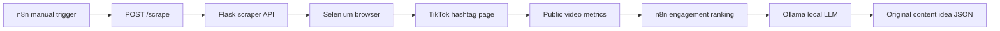

# TikTok Viral AI Automation


A local-first automation project that scrapes public TikTok hashtag pages, ranks videos by engagement signals, and uses an n8n + Ollama workflow to generate original short-form video ideas from trend patterns.

This repository is designed for creators, automation builders, and AI workflow developers who want a reusable trend-research pipeline without sending trend data to a hosted AI provider.

## What It Does

- Runs a Flask API around a Selenium TikTok scraper.
- Accepts a hashtag and video limit from n8n.
- Scrapes public video links, descriptions, hashtags, and engagement stats.
- Ranks videos by a weighted engagement score.
- Builds a structured trend-analysis prompt.
- Sends the prompt to a local Ollama model.
- Produces an original hook, script, caption, hashtag set, and production notes.

The project generates creative direction only. It does not download TikTok videos, repost content, or publish automatically.

## Architecture



## Tech Stack

| Layer | Tool | Purpose |
| --- | --- | --- |
| API | Flask | Local HTTP endpoint for n8n |
| Browser automation | Selenium | Public hashtag and video-page scraping |
| Driver management | webdriver-manager | ChromeDriver installation |
| HTML parsing | BeautifulSoup | Extract visible metadata |
| Workflow | n8n | Orchestration and prompt preparation |
| AI | Ollama | Local script and idea generation |

## Repository Structure

```text
.
|-- README.md
|-- LICENSE
|-- requirements.txt
|-- .env.example
|-- src/
|   `-- tiktok_deep_scrape.py
|-- workflow/
|   |-- README.md
|   `-- tiktok-viral-ai-automation.json
|-- docs/
|   |-- SETUP.md
|   |-- API.md
|   |-- WORKFLOW.md
|   `-- TROUBLESHOOTING.md
|-- scripts/
|   `-- validate-project.js
`-- .github/
    `-- workflows/
        `-- validate.yml
```

## Quick Start

1. Install Python 3.10+ and Google Chrome.
2. Install dependencies:

```bash
pip install -r requirements.txt
```

3. Start Ollama and pull a local model:

```bash
ollama pull llama3.1
```

4. Run the scraper API:

```bash
python src/tiktok_deep_scrape.py
```

5. Test the API:

```bash
curl -X POST http://localhost:5000/scrape \
  -H "Content-Type: application/json" \
  -d "{\"hashtag\":\"funny\",\"limit\":5}"
```

6. Import [workflow/tiktok-viral-ai-automation.json](workflow/tiktok-viral-ai-automation.json) into n8n.
7. Connect your Ollama credential in n8n and run the manual trigger.

For a complete walkthrough, see [docs/SETUP.md](docs/SETUP.md).

## API Request

```json
{
  "hashtag": "funny",
  "limit": 5
}
```

## API Response

```json
[
  {
    "hashtag_searched": "funny",
    "author": "creator",
    "video_link": "https://www.tiktok.com/@creator/video/123",
    "playCount": 100000,
    "diggCount": 12000,
    "commentCount": 300,
    "shareCount": 900,
    "collectCount": 800,
    "hashtags": ["#funny"],
    "description_full": "Example public caption"
  }
]
```

## Configuration

Copy `.env.example` if you want to customize defaults:

| Variable | Default | Purpose |
| --- | --- | --- |
| `HOST` | `0.0.0.0` | Flask bind host |
| `PORT` | `5000` | Flask port |
| `DEFAULT_HASHTAG` | `funny` | Hashtag used when none is provided |
| `DEFAULT_LIMIT` | `5` | Default videos per scrape |
| `MAX_LIMIT` | `20` | Safety cap for a single request |
| `HEADLESS_MODE` | `true` | Run Chrome in headless mode |
| `SCROLL_PASSES` | `3` | Number of hashtag-page scrolls |
| `REQUEST_DELAY_MIN` | `1` | Minimum delay between video pages |
| `REQUEST_DELAY_MAX` | `3` | Maximum delay between video pages |
| `LOG_LEVEL` | `INFO` | Python logging level |

## Validation

Run the local project validation:

```bash
node scripts/validate-project.js
```

GitHub Actions also validates the workflow JSON and Python syntax on every push and pull request.

## Responsible Use

Use this project for research and original ideation. Respect TikTok's terms, avoid aggressive scraping, do not copy creator content, and review generated ideas before using them commercially.

## Documentation

- [Setup Guide](docs/SETUP.md)
- [API Reference](docs/API.md)
- [Workflow Guide](docs/WORKFLOW.md)
- [Troubleshooting](docs/TROUBLESHOOTING.md)

## Author

Built by **Abuzar Saleem**, AI and automation engineer.

- Email: contactbyabuzar@gmail.com
- LinkedIn: [Abuzar Saleem](https://www.linkedin.com/in/abuzar-saleem-907345386/)

## License

This project is released under the [MIT License](LICENSE).
